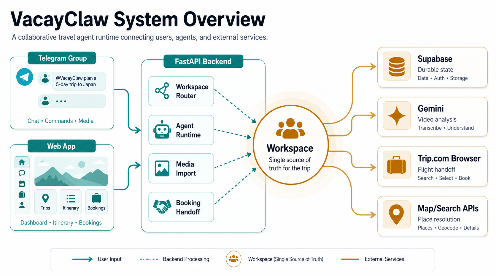
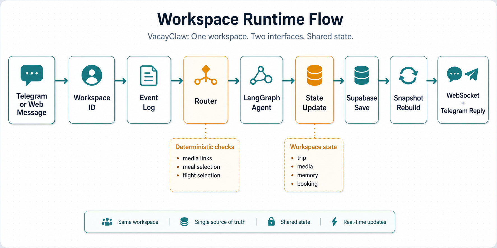
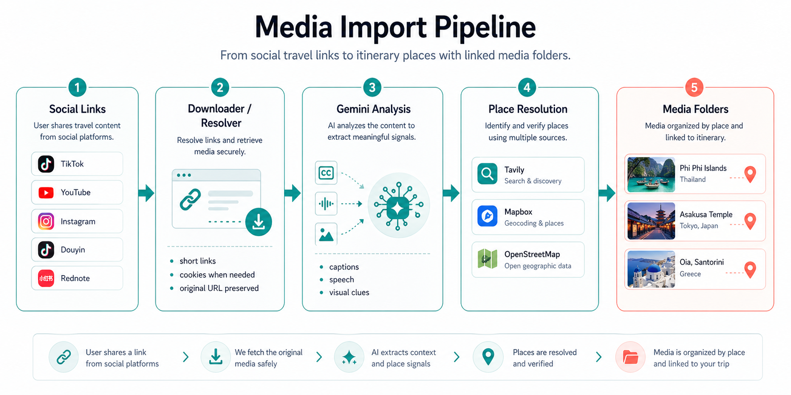
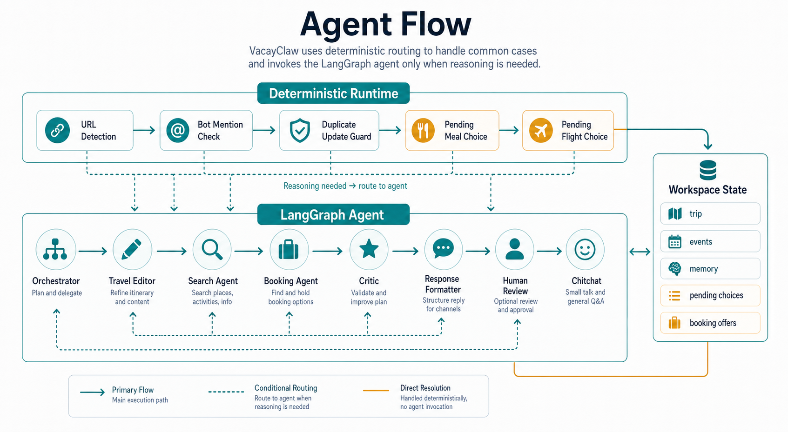
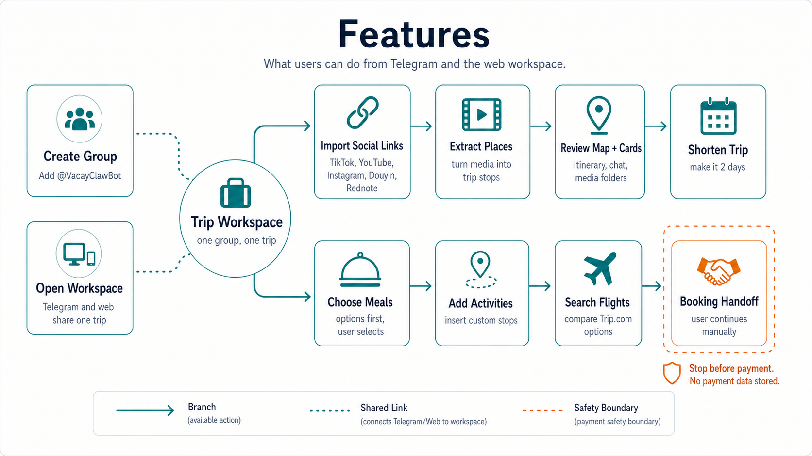
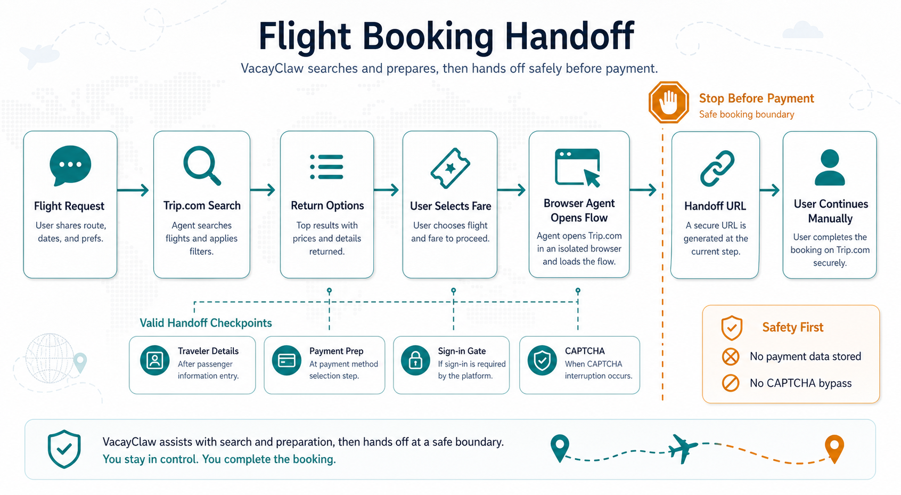

# VacayClaw: From Social Travel Links to a Shared AI Trip Workspace

## Team

Group: VacayClaw

- Zhang Jing Wen, A0328926R
- Song Hao Ran, A0329715X
- Peng Xianhan, A0331792B
- Hu Aoqi, A0329937L

GitHub: [Vacay_UGC-AI-Travel-Planner](https://github.com/pebblepaw/Vacay_UGC-AI-Travel-Planner)

1. Overview
VACAY is an AI-powered travel planner that turns short-form travel videos (TikTok, Douyin, YouTube Shorts) into interactive, editable itineraries. 
You can make a Telegram group with your friends, add the VACAY bot, send it links to video that you’ve already saved, and VACAY automatically extracts locations, builds a day-by-day trip plan, pins everything to the map, and lets the user see it all on a hosted website. 
Users can iteratively ask the agent to improve the plan, shorten the trip, find cool locations for lunch, and view all the uploaded media together in one place. 
When the user is happy with their plan, they can also ask the agent to book a flight, handing it back to the user upon reaching the payments page.

2. What Problem are we solving?
Travel planning often starts in social media, not in a travel app. Users save TikToks, YouTube Shorts, Instagram posts, Douyin clips, and Rednote links, then paste them into a group chat. Useful information is scattered across video captions, speech, comments, locations, and friends' messages.
That creates four product problems: 
First, it is labour intensive to crawl through all your saved videos. 
Second, everyone uses a group chat, but all these details get lost over time. 
Third, most planning tools are not collaborative. 
Fourth, booking and planning are not done seamlessly together. 
VacayClaw addresses ALL these problems. 

3. What We Built

VacayClaw has two control surfaces: Telegram and a web workspace. They're the same trip, just viewed from different places.

On Telegram, you create a group, add @VacayClawBot, and start sending links. The bot maps your group to a trip and starts building it. If you use Telegram forum topics, each topic can own its own separate trip.

On the web side, the bot sends you a signed link. Open it and you see the same itinerary, map, chat history, and media folders — live. Messages you send from the web show up in the Telegram group. Messages from Telegram show up in the browser. No refresh needed.

The whole system is built on one rule: the workspace owns the trip. Everything — importing videos, editing the itinerary, choosing meals, booking flights — updates one shared workspace. Supabase stores all of it.

4. How the System Works

The stack is FastAPI on the backend, React on the frontend, Supabase for persistence, and LangGraph for the agent layer.

When a message comes in from Telegram or the web, the backend resolves it to a workspace, routes it through either a deterministic handler or the LangGraph agent, and updates the trip state in Supabase. After any state change, the backend rebuilds a snapshot and pushes it to all open browser tabs via WebSocket.

The frontend is a pure reader — it never owns the trip state. It loads the latest snapshot and subscribes to updates. A Telegram group and a browser tab are just two windows into the same workspace.

5. Turning Videos Into Places

When a link comes in, the backend detects the platform — TikTok, YouTube, Instagram, Douyin, or Rednote — downloads or resolves the media where the platform allows it, and sends it to Gemini. Gemini extracts candidate places and descriptions. We then use Tavily, Mapbox, and OpenStreetMap geocoding to turn those place names into real coordinates. Each place card keeps a reference back to the source video so you can always trace where a recommendation came from.

Douyin and Rednote are aggressive about blocking access without fresh cookies. When a download fails, the system saves whatever succeeded and keeps the rest of the workspace usable. Partial imports don't break the trip.

6. The Agent: Where We Use AI and Where We Don't

We made a deliberate choice early on: don't run everything through the AI agent. Deterministic routing is faster, more predictable, and much easier to debug for the paths that matter most.

Anything with a clear pattern is handled deterministically. Detecting a media link triggers import. A duplicate Telegram delivery is ignored. A meal request creates a pending choice. A selection reply resolves it.

The LangGraph agent handles the parts where reasoning actually helps: editing the itinerary, searching for places, interpreting booking intent, formatting responses, and general conversation. The agent graph has specialist nodes — orchestrator, travel editor, search agent, booking agent, critic, and chitchat — that get invoked based on what the user is asking.

The most important rule we stuck to was user control. For meals and flights, the agent never silently picks. It presents options, stores the pending choice, and waits. That keeps the demo stable and keeps the user in control for high-stakes decisions.

7. The Web Experience

The web app is built for desktop demo use. The layout is map and trip cards side by side, with chat on the right as the shared control surface.

When you open a workspace link, the frontend loads the latest snapshot and connects to a live WebSocket. Every time the backend rebuilds the workspace — after an import, an edit, a meal selection — all open browser tabs get the update instantly. Changes you make in Telegram appear on screen without touching the browser.

The cards page handles media gracefully. Each location can carry linked media. Clicking opens an overlay: videos autoplay muted, YouTube uses an embedded player, and unsupported TikTok or Douyin sources fall back to a clickable source link rather than a broken embed. We made that fallback explicit after seeing how often platforms block direct playback.

8. Flight Booking Handoff

Flights are inside the planning loop, but payment is not — and that's intentional.

When you ask for flights, the agent searches Trip.com, returns options, and waits for you to choose. Once you pick one, browser automation opens the booking flow and navigates forward until it hits a point that needs a human: a traveler details form, a payment page, a sign-in gate, or a CAPTCHA. At that point, the agent sends you the current URL and stops.

We don't store payment details. We don't try to get past CAPTCHA. The agent's job ends at handing you the right page — what happens next is yours.

9. What We Verified

We verified everything against a local demo path: local frontend and backend, Telegram webhook delivery, and Supabase as the live store. The core behaviors all work — creating a workspace from a new Telegram group, opening it in the browser via a signed link, sending messages in both directions, importing media where platforms allow, editing the itinerary, running meal and flight requests through the pending-choice flow, and handing off to Trip.com before payment.

The honest caveat: some integrations are environment-dependent. Platform cookies, CAPTCHA appearances, and Telegram webhook timing can all affect a live run. When external automation hits a wall, the system keeps the workspace intact and hands control back to the user.

10. What We Hardened and What Still Needs Work

VacayClaw is a strong demo build, not a production travel agent.

Douyin and Rednote can block downloads without fresh cookies. Telegram webhooks can time out if a media import runs long — production would move those jobs into a background queue. Trip.com can show CAPTCHA or require manual sign-in. AWS deployment is scaffolded but the release is evaluated as a local demo, not a hardened cloud deployment. Concurrent editing by multiple users works at the workspace level but wasn't the main tested path.

11. Conclusion

VacayClaw turns saved social links into a shared trip workspace. Instead of leaving TikTok, YouTube, Instagram, Douyin, and Rednote links buried in a group chat, the system extracts places, builds an itinerary, links media to destination cards, and lets the whole group edit the trip from Telegram or the web.

The thing we're most proud of is the shared runtime. Every action — importing a video, editing a day, choosing a restaurant, booking a flight — happens inside one workspace. You can switch between Telegram and the browser without losing anything.

Appendix: Key Implementation Files

- backend/routers/telegram.py
- backend/routers/workspaces.py
- backend/services/workspace_runtime.py
- backend/services/video_downloader.py
- backend/services/gemini_analyzer.py
- backend/services/itinerary_builder.py
- backend/services/booking_intent.py
- backend/services/browser_takeover.py
- backend/agent/graph.py
- backend/agent/state.py
- frontend/src/contexts/TripContext.tsx
- frontend/src/components/trip/CardsView.tsx
- frontend/src/components/trip/ChatSidebar.tsx
- scripts/codex/verify.sh
