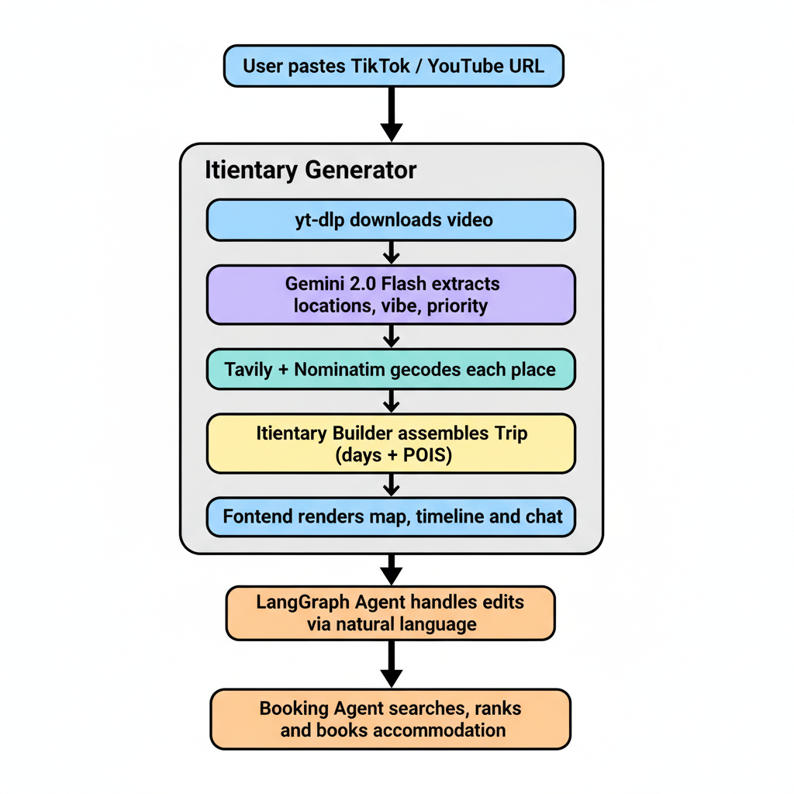
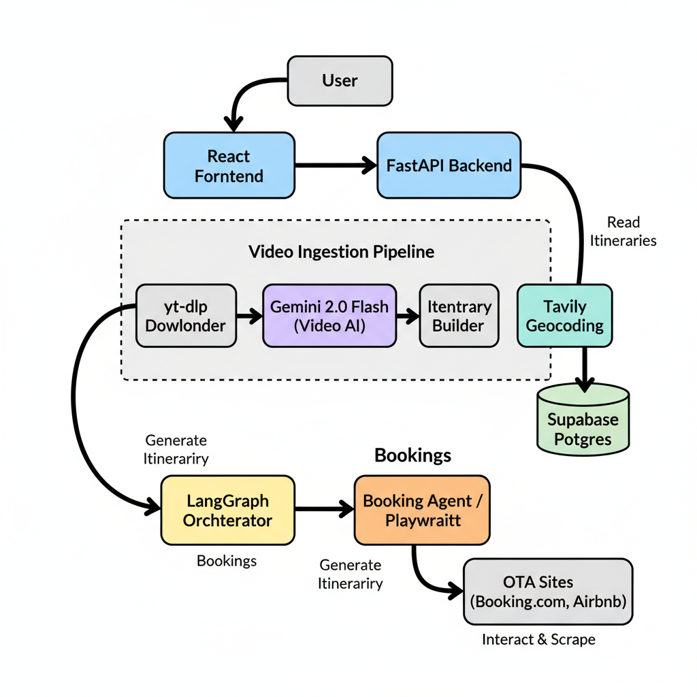
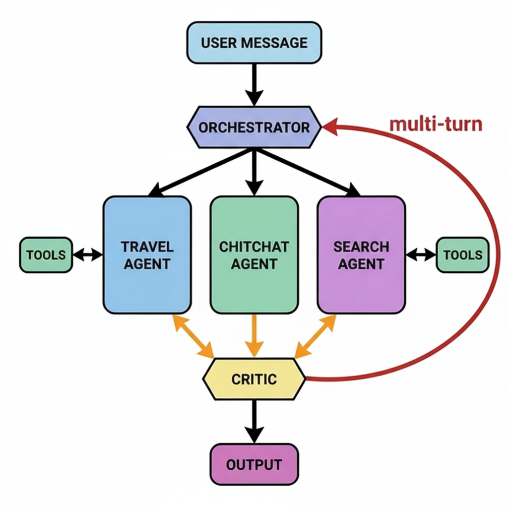
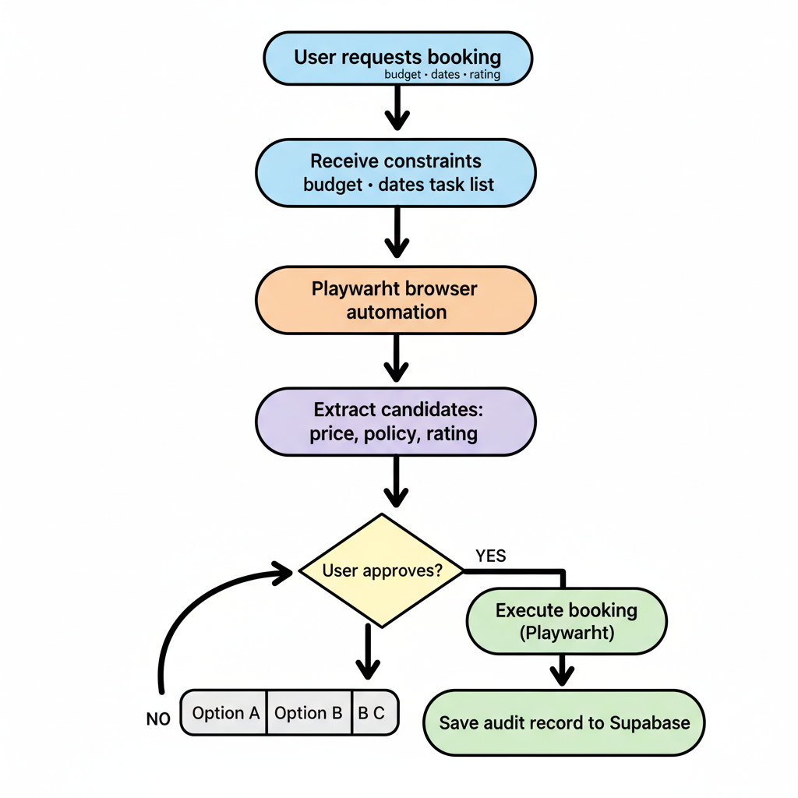
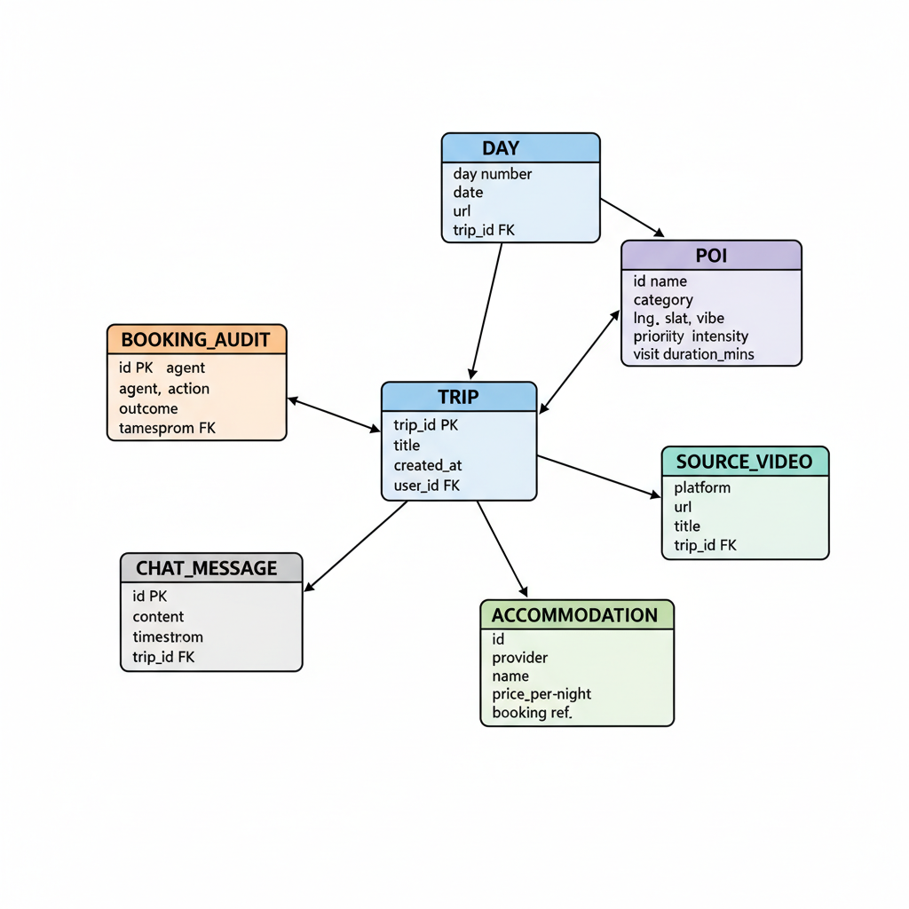

# VACAY — Project Proposal

> **Historical note:** This file is the original proposal. It is not the current source of truth. For the live codebase, read `docs/agent_handoff.md`, `docs/brd/overview.md`, `docs/brd/architecture.md`, and `docs/progress/phase8.md`.

**Module**: Neural Networks and Intelligent Systems  
**Project Type**: Original Technical Build  
**Team**: Pebblepaw  
**Date**: February 2026  

---

## What is VACAY?

VACAY is an AI-powered travel planner that turns short-form travel videos (TikTok, YouTube Shorts) into interactive, editable itineraries. Instead of starting from a blank search form, users paste links to videos they've already saved, and VACAY automatically extracts locations, builds a day-by-day trip plan, pins everything on a map, and lets the user refine the plan through a chat interface powered by a custom LangGraph multi-agent system. When the user is happy with their plan, a browser automation agent handles accommodation and activity booking end-to-end.

The idea is simple: people already do a ton of travel research on TikTok, but there's no good way to convert all those saved videos into an actual, actionable trip. VACAY closes that gap — from inspiration to itinerary to booked.

**The core user flow:**

```
User pastes TikTok URL
      ↓
Backend downloads video with yt-dlp
      ↓
Gemini 2.0 Flash extracts locations, vibe, priority
      ↓
Tavily/Nominatim geocodes each place
      ↓
Itinerary Builder assembles a structured Trip (days, POIs)
      ↓
Frontend renders map + timeline + chat
      ↓
LangGraph Agent handles further edits via natural language
      ↓
Booking Agent searches, ranks, and books accommodation + tickets
```



---

## Problem / Gap

Travel planning is weirdly fragmented. You discover places on social media, save them, then manually re-type them into Google Maps, Notes, and spreadsheets before finally switching to OTAs to book. Traditional planners (Booking.com, Google Trips, TripIt) all assume you start from a destination + date query — none of them ingest your personal UGC library as the first-class input. VACAY fills this gap: UGC-first planning with an agentic layer that handles both the editing and the booking.

---

## Tech Stack

| Layer | Technology |
|---|---|
| Frontend | React + Vite + TailwindCSS + Shadcn UI + Framer Motion |
| Backend | Python 3.11 + FastAPI |
| Database | Supabase (Postgres) |
| AI / Extraction | Google Gemini 2.0 Flash (video analysis + chat) |
| Agent Framework | LangGraph + LangChain |
| Video Download | yt-dlp |
| Geocoding | Tavily API + Nominatim (OpenStreetMap) |
| Maps | Mapbox Static API |
| Web Search | DuckDuckGo Search |
| Browser Automation | Playwright |

---

## Diagram 1: Overall System Architecture



---

## Agentic AI Design — The LangGraph Orchestrator

The core intelligence of VACAY is powered by a multi-agent orchestrator implementing advanced LLM design patterns (Plan-and-Execute, ReAct, and Reflexion). Instead of a monolithic prompt, specialist nodes handle different classes of intent, mutating a shared Trip state.

### Diagram 2: LangGraph Agent Loop



### Agent Nodes

| Node | Role |
|---|---|
| **Orchestrator** | Implements the Supervisor pattern. Classifies user intent and decomposes complex requests into multi-step plans (e.g., "swap lunch for sushi" → search sushi + swap poi). |
| **Travel Editor** | Specialist LLM that analyzes the user's current trip and selects tool calls to modify it. Does not modify state directly; instead emits tool calls. |
| **Search Agent** | Finds external places via web search and retrieves structured candidate data. |
| **ChitChat Agent** | Handles off-topic questions, greetings, and general travel conversation. |
| **Travel Tool Executor** | A custom state-aware node. It executes mutations (add, swap, move, delete) directly against the shared trip state rather than returning raw text strings. |
| **Search Tool Node** | Standard LangGraph ToolNode execution for stateless queries (Tavily & Nominatim). |
| **Critic (Reflection)** | Implements the Reflexion pattern. Validates the modified trip for timing overlap, geographic jumps, intensity balance, and completeness. Rejects bad edits via a maximum 3-iteration multi-turn loop. |

### Tools

| Tool | What it does |
|---|---|
| `delete_poi` | Removes a specific point of interest securely by its unique ID. |
| `add_poi` | Inserts a new geocoded place structure into the correct day timeline. |
| `swap_poi` | Replaces an existing location with a new one in a single atomic transaction. |
| `move_poi` | Shifts an activity between days to balance intensity or schedule. |
| `replan_day` | Algorithmic resequencing of a single day based on time-of-day heuristics and geographic sorting. |
| `optimize_trip` | Global cross-day geographic clustering and day assignment algorithm. |
| `search_places` | Wraps Tavily Search and OpenStreetMap Nominatim to retrieve highly structured, geocoded place objects from natural language queries. |

---

## Booking Agent

Once the user is happy with their itinerary, a dedicated browser automation agent handles accommodation search and booking. This uses Playwright to navigate OTA sites like Booking.com and Airbnb as a real user would, extract options, normalize them into a comparable format, and present them for the user to select and confirm.

### Diagram 3: Booking Agent Workflow



### Booking Agent Design

**Intent and Constraints**: The booking agent receives a `BookingIntent` object containing the trip ID, segment (accommodation or ticket), dates, budget cap, minimum rating, cancellation preference, and maximum distance from the itinerary centroid. These constraints are applied as hard filters before ranking.

**Browser Execution**: Playwright drives real browser sessions against OTA providers. The agent uses deterministic navigation scripts with structured extraction selectors to pull price, fees, policy terms, distance, and availability data. A retry policy handles transient failures, and a cross-check step validates extracted prices against displayed values before presenting to the user.

**Option Ranking**: Extracted options are normalized into `BookingOption` objects and scored on a weighted formula balancing price, distance from day centroid, rating, and cancellation flexibility. The top 3–5 options are presented in a comparison card in the frontend.

**Human-in-the-loop**: The booking agent never autonomously commits a financial action. Every booking requires explicit user selection and a final confirmation click before the Playwright session proceeds to checkout. If the user rejects, the agent returns to the options list.

**Failure Handling**: The agent handles selector drift, bot-defense pages, inventory changes, and session expiry with bounded retries and graceful fallback to alternative providers. All outcomes — success or failure — are logged as audit events in Supabase.

| Object | Fields |
|---|---|
| `BookingIntent` | `trip_id`, `segment`, `dates`, `budget_cap`, `min_rating`, `cancellation_pref`, `max_distance_km` |
| `BookingOption` | `provider`, `price`, `fees`, `policy`, `distance_km`, `rating`, `score`, `source_url`, `checked_at` |
| `AuditEvent` | `timestamp`, `agent`, `action`, `outcome`, `screenshot_ref` |

---

## Diagram 4: Data Model



---

## Why This is Relevant to Neural Networks

| Concept | How VACAY uses it |
|---|---|
| **Multimodal Transformers** | Gemini 2.0 Flash processes raw video frames + audio to extract structured location data as JSON. |
| **LLM-based Intent Classification** | The Orchestrator uses Gemini to classify user messages into routing labels and decompose complex requests. |
| **Agentic Tool Use (ReAct)** | The agents select and invoke state-mutating tool calls in a loop — the classic Reason + Act pattern. |
| **Multi-Agent Orchestration** | Specialist working nodes with clear definitions, custom graph edges, conditional routing, and shared state. |
| **Reflection & Self-Correction (Reflexion)** | The Critic node evaluates agent outputs for logical, timing, or geographic errors and forces multi-turn corrections. |
| **Browser-level Autonomous Execution** | The Booking Agent uses Playwright to complete real-world tasks with policy-bounded autonomy. |

---

## References

Agoda. (2025). *Generation TikTok: social media emerges as Gen Z's new travel tour guide*. https://www.agoda.com/press/generation-tiktok-social-media-emerges-as-gen-zs-new-travel-tour-guide/

DataReportal. (2026). *Digital 2026: Global overview report*. https://datareportal.com/reports/digital-2026-global-overview-report

Expedia Group. (2025). *Unpack '25: The trends in travel*. https://www.expediagroup.com/newsroom/expedia-group-news/article/expedia-group-unpack-25-the-trends-in-travel/

UN Tourism. (2025). *International tourism to reach pre-pandemic levels in 2024*. https://www.unwto.org/news/international-tourism-to-reach-pre-pandemic-levels-in-2024
